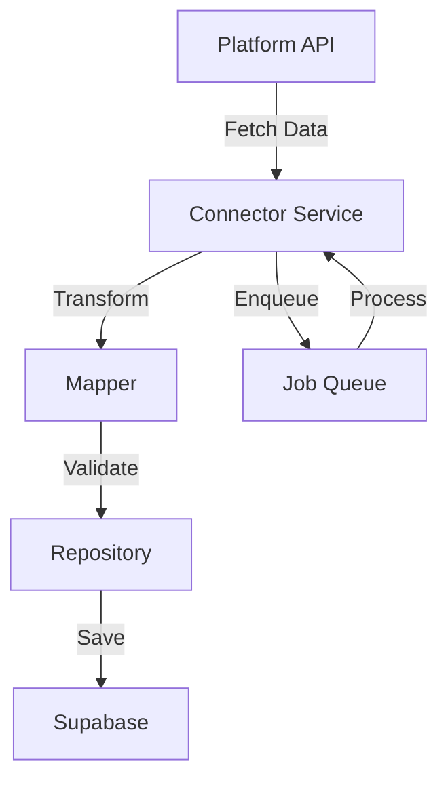

## Overview

CrossConnect-Phos provides pre-built connectors for major e-commerce marketplaces and warehouse management systems. Each connector handles authentication, data synchronization, and platform-specific logic.

## Supported platforms

<CardGroup cols={2}>
  <Card title="Amazon" icon="amazon" iconType="brands" href="/connectors/amazon">
    Amazon Seller Central and MWS API integration
  </Card>
  <Card title="Walmart" icon="store" href="/connectors/walmart">
    Walmart Marketplace API integration
  </Card>
  <Card title="Shopify" icon="shopify" iconType="brands" href="/connectors/shopify">
    Shopify Admin API and webhooks
  </Card>
  <Card title="TikTok Shop" icon="tiktok" iconType="brands" href="/connectors/tiktok">
    TikTok Shop API integration
  </Card>
  <Card title="Faire" icon="handshake" href="/connectors/faire">
    Faire wholesale marketplace
  </Card>
  <Card title="Target" icon="bullseye" href="/connectors/target">
    Target Plus marketplace
  </Card>
  <Card title="Warehance" icon="warehouse" href="/connectors/warehance">
    Warehance WMS integration
  </Card>
</CardGroup>

## Connector architecture

Each connector follows a consistent structure:

```
connectors/[platform]/
├── [platform].module.ts      # Module definition
├── [platform].controller.ts  # API endpoints
├── [platform].service.ts     # Business logic
├── [platform].mapper.ts      # Data transformation
└── [platform].types.ts       # TypeScript types
```

### Module

Defines the connector module and its dependencies:

```typescript
@Module({
  imports: [HttpModule, BullModule.registerQueue({ name: 'products' })],
  controllers: [ShopifyController],
  providers: [ShopifyService, ShopifyMapper],
  exports: [ShopifyService],
})
export class ShopifyModule {}
```

### Controller

Exposes API endpoints for the connector:

```typescript
@Controller('shopify')
export class ShopifyController {
  @Get('products')
  async getProducts(@Query('storeId') storeId: string) {
    return this.shopifyService.fetchProducts(storeId);
  }

  @Post('sync')
  async syncStore(@Body() dto: SyncStoreDto) {
    return this.shopifyService.syncStore(dto.storeId);
  }
}
```

### Service

Contains business logic and API client with initialization pattern:

```typescript
@Injectable()
export class ShopifyService {
  private client: GraphQLClient;
  private shop: string;
  private accessToken: string;

  constructor(private crypto: CryptoService) {}

  // Must be called before using service
  initialize(credentials: any): void {
    this.shop = this.crypto.decrypt(credentials.shopDomain);
    this.accessToken = this.crypto.decrypt(credentials.accessToken);

    this.client = new GraphQLClient(
      `https://${this.shop}/admin/api/2026-01/graphql.json`,
      {
        headers: {
          'X-Shopify-Access-Token': this.accessToken,
          'Content-Type': 'application/json',
        },
      }
    );
  }

  async fetchProducts(): Promise<ShopifyProductNode[]> {
    const data = await this.execute<FetchProductsQuery>(FETCH_PRODUCTS);
    return data?.products?.nodes || [];
  }
}
```

**Key pattern:** Services are initialized with decrypted credentials via `PlatformServiceFactory`.

### Mapper

Transforms platform data to internal Supabase schema:

```typescript
// Actual Shopify mapper
export function mapShopifyProductToDB(
  product: ShopifyProductNode,
  storeId: string,
): Database['public']['Tables']['products']['Insert'][] {
  return product.variants.nodes.map((variant) => {
    const productId = product.id.split('/').pop();
    const variantId = variant.id.split('/').pop();

    // Namespace SKU to avoid conflicts
    const sku = variant.sku
      ? `shopify-${productId}-${variant.sku}`
      : `shopify-${productId}-variant-${variantId}`;

    return {
      external_product_id: product.id,
      platform: 'shopify',
      store_id: storeId,
      sku,
      title: product.title,
      description: product.descriptionPlainSummary || null,
      price: variant.price ? Number(variant.price) : 0,
      currency: 'USD',
      status: product.status?.toLowerCase() ?? 'draft',
    };
  });
}
```

**Mapper responsibilities:**
- Transform platform-specific data to Supabase schema
- Handle missing/null values
- Namespace SKUs to prevent conflicts
- Extract nested data structures
- Type-safe transformations using generated types

## Common features

All connectors support:

<AccordionGroup>
  <Accordion title="Authentication">
    Each connector handles platform-specific authentication:
    - **OAuth 2.0** — Shopify, Faire, TikTok, Amazon
    - **API keys** — Walmart, Target
    - **WMS credentials** — Warehance

    **Credential encryption:**
    All credentials are encrypted using `CryptoService` before storage:
    ```typescript
    // Encryption
    const encrypted = this.crypto.encrypt(credentials.accessToken);
    await storeCredentialsRepo.save({ credentials: encrypted });

    // Decryption
    const decrypted = this.crypto.decrypt(stored.credentials.accessToken);
    ```

    Credentials are stored in the `store_credentials` table with JSONB type.
  </Accordion>

  <Accordion title="Data synchronization">
    Connectors sync three main data types:
    - **Products** — SKUs, prices, inventory, descriptions
    - **Orders** — Order details, customer info, fulfillment status
    - **Returns** — Return requests, reasons, refund status

    Sync can be triggered manually or scheduled automatically.
  </Accordion>

  <Accordion title="Webhooks (where supported)">
    Real-time event processing for:
    - Shopify
    - TikTok
    - Walmart

    Other platforms use polling-based sync.
  </Accordion>

  <Accordion title="Error handling">
    Robust error handling with:
    - Automatic retries with exponential backoff
    - Rate limit detection and throttling
    - Detailed error logging
    - Alert generation for critical failures
  </Accordion>

  <Accordion title="Rate limiting">
    Respects platform rate limits:
    - Shopify: 2 requests/second
    - Amazon: Varies by endpoint
    - Walmart: 5000 requests/day

    Implements request throttling and queuing.
  </Accordion>
</AccordionGroup>

## Adding a store

To connect a new store to a platform:

<Steps>
  <Step title="Create store record">
    ```typescript
    const store = await storesRepository.create({
      name: 'My Shopify Store',
      platform: 'shopify',
      status: 'active',
    });
    ```
  </Step>

  <Step title="Add credentials">
    ```typescript
    await storeCredentialsRepository.create({
      store_id: store.id,
      platform: 'shopify',
      credentials: {
        shop: 'mystore.myshopify.com',
        accessToken: 'shpat_xxxxx',
      },
    });
    ```
  </Step>

  <Step title="Trigger initial sync">
    ```typescript
    await shopifyService.syncStore(store.id);
    ```
  </Step>
</Steps>

## Connector status

Monitor connector health in the dashboard:

- **Active** — Connector is syncing successfully
- **Error** — Recent sync failures detected
- **Paused** — Sync temporarily disabled
- **Disconnected** — Credentials invalid or expired

## Data flow



1. Connector service fetches data from platform API
2. Mapper transforms data to internal format
3. Repository validates and saves to database
4. Background jobs handle async processing

## Configuration

### Per-store settings

Each store can have custom sync settings:

```typescript
{
  syncInterval: 15,           // Minutes between syncs
  syncProducts: true,         // Enable product sync
  syncOrders: true,           // Enable order sync
  syncReturns: false,         // Disable return sync
  webhooksEnabled: true,      // Use webhooks if available
}
```

### Global settings

Platform-wide settings in environment variables:

```bash
# Rate limiting
SHOPIFY_MAX_REQUESTS_PER_SECOND=2
AMAZON_MAX_REQUESTS_PER_MINUTE=60

# Retry configuration
MAX_RETRY_ATTEMPTS=3
RETRY_BACKOFF_MS=5000
```

## Best practices

<AccordionGroup>
  <Accordion title="Use webhooks when available">
    Webhooks provide real-time updates and reduce API calls. Enable webhooks for Shopify, TikTok, and Walmart.
  </Accordion>

  <Accordion title="Respect rate limits">
    Always implement rate limiting to avoid API bans. Use exponential backoff for retries.
  </Accordion>

  <Accordion title="Handle partial failures">
    If syncing 1000 products and one fails, continue with the rest. Log failures for review.
  </Accordion>

  <Accordion title="Validate credentials regularly">
    Periodically test credentials to detect expired tokens before sync failures occur.
  </Accordion>

  <Accordion title="Monitor sync health">
    Track sync success rates and alert on anomalies. Set up dashboards for visibility.
  </Accordion>
</AccordionGroup>

## Troubleshooting

<AccordionGroup>
  <Accordion title="Authentication failures">
    **Symptoms:** 401 Unauthorized errors

    **Solutions:**
    - Verify credentials in `store_credentials` table
    - Check if access token has expired
    - Ensure API permissions are correctly configured
    - Re-authenticate the store if needed
  </Accordion>

  <Accordion title="Rate limit errors">
    **Symptoms:** 429 Too Many Requests errors

    **Solutions:**
    - Reduce sync frequency
    - Implement request throttling
    - Use webhooks instead of polling
    - Spread syncs across multiple time windows
  </Accordion>

  <Accordion title="Data sync failures">
    **Symptoms:** Missing or outdated data

    **Solutions:**
    - Check job queue for failed jobs
    - Review error logs for specific failures
    - Verify data mapping logic
    - Manually trigger re-sync
  </Accordion>

  <Accordion title="Webhook not receiving events">
    **Symptoms:** No webhook events received

    **Solutions:**
    - Verify webhook URL is publicly accessible
    - Check webhook configuration in platform
    - Ensure HTTPS is enabled
    - Test with platform's webhook testing tool
  </Accordion>
</AccordionGroup>

## Platform-specific guides

<CardGroup cols={2}>
  <Card title="Amazon" icon="amazon" iconType="brands" href="/connectors/amazon">
    MWS and SP-API integration
  </Card>
  <Card title="Walmart" icon="store" href="/connectors/walmart">
    Marketplace API setup
  </Card>
  <Card title="Shopify" icon="shopify" iconType="brands" href="/connectors/shopify">
    Admin API and webhooks
  </Card>
  <Card title="TikTok Shop" icon="tiktok" iconType="brands" href="/connectors/tiktok">
    Shop API integration
  </Card>
</CardGroup>

## Next steps

<CardGroup cols={2}>
  <Card title="Background jobs" icon="gears" href="/guides/jobs">
    Learn how connectors use job queues
  </Card>
  <Card title="Webhooks" icon="webhook" href="/guides/webhooks">
    Set up real-time event processing
  </Card>
  <Card title="Backend development" icon="server" href="/guides/backend">
    Build custom connectors
  </Card>
  <Card title="Troubleshooting" icon="wrench" href="/guides/troubleshooting">
    Solve common connector issues
  </Card>
</CardGroup>
