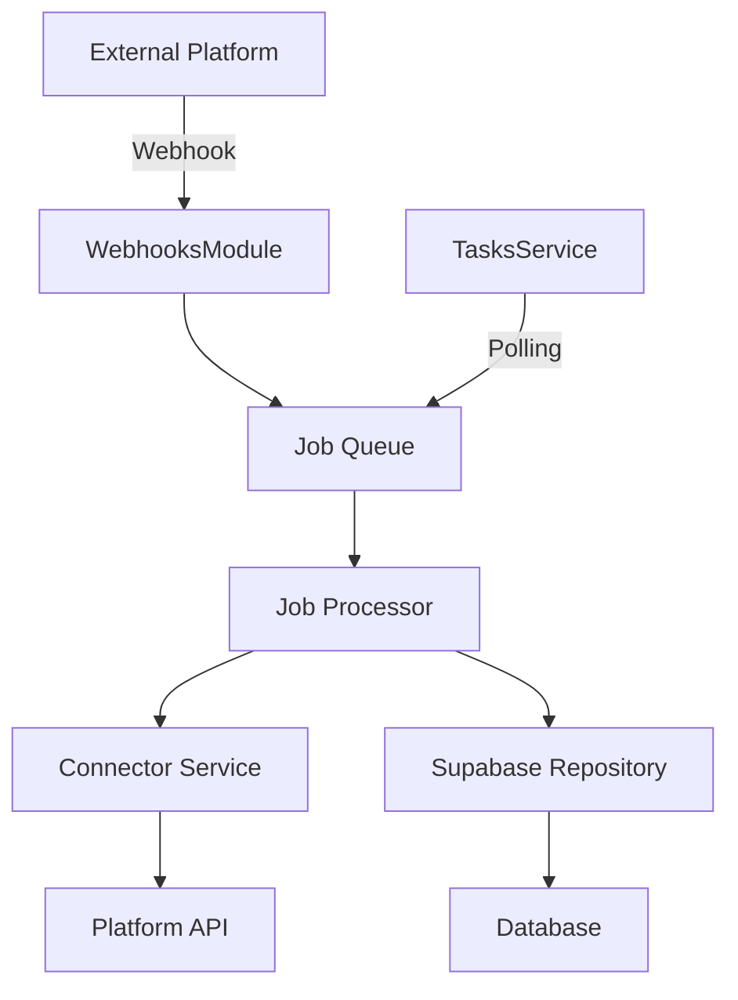
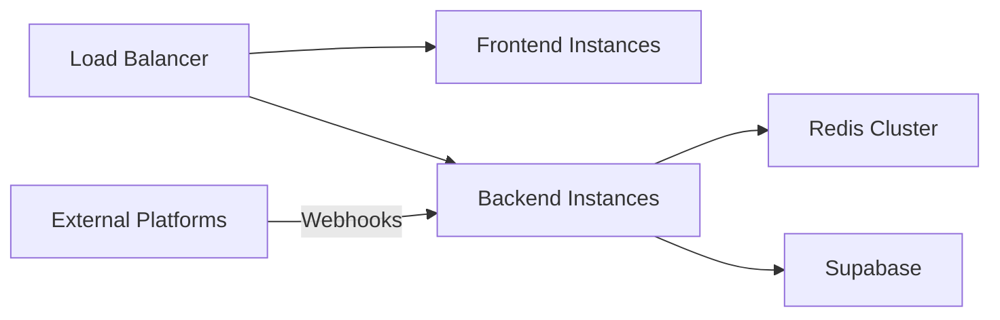

## System overview

CrossConnect-Phos is built as a modular, scalable integration platform with two main components:

<CardGroup cols={2}>
  <Card title="Backend (NestJS)" icon="server">
    Handles connectors, background jobs, webhooks, and data persistence
  </Card>
  <Card title="Frontend (Next.js)" icon="browser">
    Provides dashboard UI and management interface
  </Card>
</CardGroup>

## Backend architecture

The backend is built with NestJS and follows a modular architecture pattern.

### Core modules

<AccordionGroup>
  <Accordion title="AppModule" icon="cube">
    The root module that wires together all other modules:
    - **ConfigModule** — Environment configuration and validation
    - **SupabaseModule** — Database and storage connections via `nestjs-supabase-js`
    - **BullModule** — Redis-based job queue connection with BullMQ
      - Connection timeout: 10 seconds
      - Max retries per request: null (required for BullMQ)
      - Default job options: `removeOnComplete: true`, `removeOnFail: false`
    - **ConnectorsModule** — Marketplace and warehouse integrations
    - **JobsModule** — Background job processors with retry logic
    - **WebhooksModule** — Incoming webhook handlers
    - **LoggerModule** — Structured logging with `nestjs-pino`
      - Development: Pretty-printed colored logs
      - Production: JSON structured logs
    - **CommonModule** — Shared utilities (CryptoService, guards)
    - **ScheduleModule** — Cron-based task scheduling

    **Location:** `backend/src/app.module.ts`

    **Key configuration:**
    ```typescript
    BullModule.forRoot({
      connection: {
        host: process.env.REDIS_HOST || 'localhost',
        port: parseInt(process.env.REDIS_PORT || '6379'),
        password: process.env.REDIS_PASSWORD,
        tls: {},
        maxRetriesPerRequest: null,  // Required for BullMQ
        connectTimeout: 10000,
      },
    })
    ```
  </Accordion>

  <Accordion title="ConnectorsModule" icon="plug">
    Manages integrations with external platforms. Each connector is a feature module with:
    - Controller — API endpoints for the connector
    - Service — Business logic and API client
    - Mapper — Data transformation between platform and internal formats

    **Supported connectors:**
    - Amazon
    - Walmart
    - Shopify
    - TikTok
    - Faire
    - Target
    - Warehance

    **Location:** `backend/src/connectors/`
  </Accordion>

  <Accordion title="JobsModule" icon="gears">
    Handles background processing with BullMQ. Registers three main queues:
    - **products** — Product data synchronization
    - **orders** — Order data synchronization
    - **returns** — Return data synchronization

    Each queue has a dedicated processor that handles job execution, retries, and error handling.

    **Location:** `backend/src/jobs/`
  </Accordion>

  <Accordion title="WebhooksModule" icon="webhook">
    Processes incoming webhooks from platforms that support real-time events:
    - Shopify webhooks
    - TikTok webhooks
    - Walmart webhooks

    Each webhook handler validates signatures and enqueues appropriate jobs.

    **Location:** `backend/src/api/webhooks/connectors/`
  </Accordion>

  <Accordion title="SupabaseModule" icon="database">
    Provides repositories for database access:
    - StoresRepository — Store configuration and status
    - StoreCredentialsRepository — Platform credentials (encrypted)
    - OrdersRepository — Order data
    - ProductsRepository — Product data
    - AlertsRepository — System alerts and notifications

    **Location:** `backend/src/supabase/`
  </Accordion>

  <Accordion title="TasksModule" icon="clock">
    Manages scheduled tasks using NestJS Schedule:
    - **Polling** — Checks active stores and enqueues sync jobs
    - **Health checks** — Runs every 5 minutes
    - **Cleanup** — Removes completed jobs older than 7 days (runs daily)

    **Location:** `backend/src/tasks/tasks.service.ts`
  </Accordion>
</AccordionGroup>

### Data flow



1. **Data ingestion** — Data enters via webhooks or scheduled polling
2. **Job enqueueing** — Tasks are added to BullMQ queues
3. **Processing** — Job processors execute tasks with retry logic
4. **API calls** — Connectors fetch/push data to platform APIs
5. **Persistence** — Data is stored in Supabase via repositories

## Frontend architecture

The frontend is built with Next.js 13+ using the App Router.

### Directory structure

```
frontend/
├── app/
│   ├── (auth)/          # Authentication routes
│   ├── (dashboard)/     # Dashboard routes
│   │   ├── integrations/
│   │   ├── orders/
│   │   ├── products/
│   │   └── settings/
│   └── layout.tsx
├── components/          # Reusable UI components
├── lib/                # Utilities and helpers
└── public/             # Static assets
```

### Key features

<CardGroup cols={2}>
  <Card title="Route groups" icon="folder-tree">
    Uses `(auth)` and `(dashboard)` route groups for layout organization
  </Card>
  <Card title="Server components" icon="server">
    Leverages React Server Components for improved performance
  </Card>
  <Card title="API integration" icon="plug">
    Communicates with backend via REST API at `/api` endpoints
  </Card>
  <Card title="Real-time updates" icon="bolt">
    Displays live sync status and job progress
  </Card>
</CardGroup>

## Technology stack

### Backend

| Technology | Purpose |
|------------|---------|
| NestJS | Application framework |
| TypeScript | Type-safe development |
| BullMQ | Job queue management |
| Redis | Queue storage and caching |
| Supabase | Database and storage |
| nestjs-pino | Structured logging |
| New Relic | Optional APM monitoring |

### Frontend

| Technology | Purpose |
|------------|---------|
| Next.js | React framework |
| React | UI library |
| TypeScript | Type-safe development |
| Tailwind CSS | Styling |

### Development

| Technology | Purpose |
|------------|---------|
| Jest | Unit and integration testing |
| ESLint | Code linting |
| Prettier | Code formatting |
| GraphQL Codegen | Type generation |

## Deployment architecture



<Card title="Learn about deployment" icon="rocket" href="/guides/deployment">
  View deployment options and production configuration.
</Card>

## Security considerations

<AccordionGroup>
  <Accordion title="Credential storage">
    Platform credentials are stored in Supabase with encryption. The `SUPABASE_SERVICE_KEY` must never be exposed in frontend code.
  </Accordion>

  <Accordion title="Webhook validation">
    All webhook endpoints validate signatures using platform-specific secrets stored in `store_credentials`.
  </Accordion>

  <Accordion title="CORS configuration">
    The backend enables CORS only for the configured `FRONTEND_URL` to prevent unauthorized access.
  </Accordion>

  <Accordion title="API authentication">
    API endpoints should implement authentication middleware (implementation depends on your auth strategy).
  </Accordion>
</AccordionGroup>

## Scalability

CrossConnect-Phos is designed to scale horizontally:

- **Backend instances** — Multiple NestJS instances can run behind a load balancer
- **Job processing** — BullMQ supports multiple workers processing jobs concurrently
- **Redis clustering** — Redis can be clustered for high availability
- **Database** — Supabase handles scaling automatically

<Note>
  For high-volume deployments, consider implementing rate limiting and request throttling for external API calls.
</Note>
