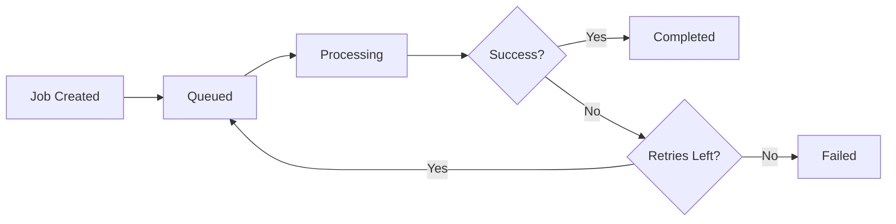

## Overview

CrossConnect-Phos uses BullMQ for background job processing. Jobs handle data synchronization between external platforms and the database, running asynchronously with retry logic and error handling.

## Job queues

Three main queues process different types of data:

<CardGroup cols={3}>
  <Card title="Products queue" icon="box">
    Synchronizes product and inventory data (concurrency: 5)
  </Card>
  <Card title="Orders queue" icon="receipt">
    Synchronizes order and order items data
  </Card>
  <Card title="Returns queue" icon="rotate-left">
    Synchronizes returns (Amazon, Walmart, Shopify, Target only)
  </Card>
</CardGroup>

### Queue configuration

Each queue is configured in `JobsModule` with:

```typescript
BullModule.registerQueue({
  name: 'products',
  defaultJobOptions: {
    attempts: 3,
    backoff: {
      type: 'exponential',
      delay: 2000,  // 2 seconds base delay
    },
    removeOnComplete: true,
    removeOnFail: false,
  },
})
```

**Job naming convention:**
- Products: `products-{storeId}-{timestamp}`
- Orders: `orders-{storeId}-{timestamp}`
- Returns: `returns-{storeId}-{timestamp}`

## How jobs work

### Job lifecycle



1. **Created** — Job is added to the queue
2. **Queued** — Job waits for an available worker
3. **Processing** — Worker executes the job
4. **Completed** — Job finishes successfully
5. **Failed** — Job fails after all retries

### Actual job configuration

Jobs created by TasksService use enhanced retry logic:

```typescript
// From tasks.service.ts
await this.productsQueue.add(
  `${store.platform}.products`,
  {
    storeId: store.id,
    platform: store.platform,
    orgId: store.org_id || 'unknown',
    credentials,
    since,  // Incremental sync timestamp
  },
  {
    jobId: `products-${store.id}-${Date.now()}`,
    removeOnComplete: true,
    attempts: 5,  // 5 retries (not 3)
    backoff: { 
      type: 'exponential', 
      delay: 5000  // 5 second base delay
    },
    removeOnFail: false,  // Keep failed jobs for debugging
  }
);
```

**Cleanup policy:**
- Completed jobs: Removed after 7 days (via daily cleanup task)
- Failed jobs: Kept indefinitely for debugging
- Cleanup runs daily at variable times via `@Interval(86400000)`

## Creating jobs

### From a service

Inject the queue and add jobs:

```typescript
import { InjectQueue } from '@nestjs/bull';
import { Queue } from 'bull';

@Injectable()
export class ShopifyService {
  constructor(
    @InjectQueue('products') private productsQueue: Queue,
  ) {}

  async syncProducts(storeId: string) {
    await this.productsQueue.add('sync', {
      storeId,
      platform: 'shopify',
      timestamp: new Date().toISOString(),
    });
  }
}
```

### Job options

Customize individual jobs:

```typescript
await this.productsQueue.add(
  'sync',
  { storeId: 'store-123' },
  {
    priority: 1,              // Higher priority (lower number = higher priority)
    delay: 60000,             // Delay 60 seconds before processing
    attempts: 5,              // Override default retry attempts
    jobId: 'unique-job-id',   // Prevent duplicate jobs
  }
);
```

## Processing jobs

### ProductsProcessor (actual implementation)

The `ProductsProcessor` handles all platform-specific product synchronization:

```typescript
import { Processor, WorkerHost } from '@nestjs/bullmq';
import { Job } from 'bullmq';

@Processor('products', { concurrency: 5 })
export class ProductsProcessor extends WorkerHost {
  constructor(
    private readonly platformFactory: PlatformServiceFactory,
    private readonly productsRepo: ProductsRepository,
    private readonly inventoryRepo: InventoryRepository,
    private readonly storeRepo: StoresRepository,
    private readonly storeCredentialsService: StoreCredentialsService,
    private readonly alertsRepo: AlertsRepository,
  ) {
    super();
  }

  async process(job: Job): Promise<void> {
    const { storeId, platform } = job.data;

    // 1. Get store and credentials
    const store = await this.storeRepo.getStoreById(storeId);
    const credentials = await this.storeCredentialsService
      .getCredentialsByStoreId(storeId);

    // 2. Create platform-specific service
    const service = await this.platformFactory.createService(
      platform,
      credentials,
      store,
    );

    // 3. Route to platform-specific handler
    switch (platform) {
      case 'shopify':
        await this.processShopifyProducts(service, store);
        break;
      case 'amazon':
        await this.processAmazonProducts(service, store);
        break;
      // ... other platforms
    }

    // 4. Update sync timestamps
    await this.supabaseClient
      .from('stores')
      .update({
        last_synced_at: new Date().toISOString(),
        last_products_synced_at: new Date().toISOString(),
      })
      .eq('id', store.id);

    // 5. Update store health
    await this.storeRepo.updateStoreHealth(storeId, 'healthy');
  }
}
```

**Key features:**
- **Concurrency: 5** — Processes up to 5 jobs simultaneously
- **Platform factory pattern** — Dynamically creates service instances
- **Delta sync** — Uses `since` parameter for incremental updates
- **Atomic operations** — Products and inventory synced together
- **Health tracking** — Updates store status on success/failure
- **Alert creation** — Logs failures to alerts table

### Error handling (actual implementation)

CrossConnect-Phos implements comprehensive error handling:

```typescript
private async processShopifyProducts(service, store) {
  try {
    // 1. Fetch products with error boundary
    const products = await service.fetchProducts();
    
    if (!products.length) {
      this.logger.warn('No products found. Skipping.');
      return;
    }

    // 2. Map and insert products
    const productRows = products.flatMap(p => 
      mapShopifyProductToDB(p, store.id)
    );
    await this.productsRepo.insertProducts(productRows);

    // 3. Sync inventory with delta detection
    const inventoryItems = await service.fetchInventory(since);
    // ... inventory processing

  } catch (error) {
    this.logger.error(
      `Shopify products failed for store ${store.id}`,
      error.stack
    );

    // Update store health
    await this.storeRepo.updateStoreHealth(
      store.id,
      'unhealthy',
      `Products sync failed: ${error.message}`
    );

    // Create alert
    await this.alertsRepo.createAlert({
      store_id: store.id,
      alert_type: 'products_sync_failure',
      message: `Shopify products sync failed: ${error.message}`,
      severity: 'high',
      platform: 'shopify',
    });

    // Re-throw to trigger BullMQ retry
    throw error;
  }
}
```

**Error handling features:**
- Detailed error logging with stack traces
- Store health status updates
- Alert creation for monitoring
- Automatic retry via BullMQ
- Platform-specific error messages

### Job events

Listen to job events:

```typescript
@Processor('products')
export class ProductsProcessor {
  @OnQueueActive()
  onActive(job: Job) {
    console.log(`Processing job ${job.id}...`);
  }

  @OnQueueCompleted()
  onCompleted(job: Job, result: any) {
    console.log(`Job ${job.id} completed:`, result);
  }

  @OnQueueFailed()
  onFailed(job: Job, error: Error) {
    console.error(`Job ${job.id} failed:`, error.message);
  }
}
```

## Scheduled jobs (actual implementation)

The TasksService uses `@Interval` decorators (not cron) for scheduling:

### pollAllActiveStores() — Main sync orchestrator

**Not currently scheduled** — Must be triggered manually or via external scheduler

```typescript
async pollAllActiveStores() {
  this.logger.log('Starting scheduled poll of all active stores');

  // 1. Fetch active stores with credentials
  const storesWithCredentials = 
    await this.storeCredentialsService.getActiveStoresWithCredentials();

  if (storesWithCredentials.length === 0) {
    this.logger.warn('No active stores with credentials found');
    return;
  }

  // 2. Process each store sequentially
  for (const { store, credentials } of storesWithCredentials) {
    try {
      // Validate credentials
      if (!credentials || Object.keys(credentials).length === 0) {
        this.logger.warn(`No credentials for store ${store.id}`);
        continue;
      }

      // Get incremental sync timestamp
      const since = store.last_synced_at
        ? new Date(store.last_synced_at).toISOString()
        : undefined;

      // Queue all three job types
      await this.queueProductsJob(store, credentials, since);
      await this.queueOrdersJob(store, credentials, since);
      await this.queueReturnsJob(store, credentials, since);

      // 500ms delay to prevent rate limiting
      await new Promise(r => setTimeout(r, 500));

    } catch (error) {
      // Update store health and create alert
      await this.storesRepository.updateStoreHealth(
        store.id,
        'unhealthy',
        `Failed to queue sync jobs: ${error.message}`
      );

      await this.alertsRepository.createAlert({
        store_id: store.id,
        alert_type: 'sync_queue_failure',
        message: `Failed to queue jobs: ${error.message}`,
        severity: 'high',
        platform: store.platform,
      });
    }
  }

  // 3. Mark stores as queued (bulk update)
  await this.markStoresAsQueued(queuedStores);
}
```

### healthCheck() — System monitoring

**Interval:** Every 5 minutes (300,000ms)

```typescript
@Interval(300000)
async healthCheck() {
  try {
    const activeStores = await this.storesRepository.getAllActiveStores();
    this.logger.debug(`Health check: ${activeStores.length} active stores`);

    // Optional: check Redis/Supabase connectivity
  } catch (error) {
    this.logger.error('Health check failed', error);
    
    await this.alertsRepository.createAlert({
      store_id: null,
      alert_type: 'health_check_failure',
      message: `Health check failed: ${error.message}`,
      severity: 'critical',
    });
  }
}
```

### cleanupOldJobs() — Queue maintenance

**Interval:** Daily (86,400,000ms)

```typescript
@Interval(86400000)
async cleanupOldJobs() {
  try {
    const cutoff = Date.now() - 7 * 24 * 60 * 60 * 1000;  // 7 days

    await Promise.all([
      this.productsQueue.clean(cutoff, 1000, 'completed'),
      this.ordersQueue.clean(cutoff, 1000, 'completed'),
      this.returnsQueue.clean(cutoff, 1000, 'completed'),
    ]);

    this.logger.log('Cleaned old completed jobs');
  } catch (error) {
    this.logger.error('Cleanup old jobs failed', error);
    
    await this.alertsRepository.createAlert({
      store_id: null,
      alert_type: 'cleanup_failure',
      message: `Cleanup failed: ${error.message}`,
      severity: 'medium',
    });
  }
}
```

**Note:** The cleanup task removes completed jobs older than 7 days, keeping the last 1000 jobs per queue.

## Monitoring jobs

### Queue statistics

Get queue statistics:

```typescript
const queue = this.productsQueue;

const jobCounts = await queue.getJobCounts();
// { waiting: 5, active: 2, completed: 100, failed: 3 }

const waiting = await queue.getWaiting();
const active = await queue.getActive();
const completed = await queue.getCompleted();
const failed = await queue.getFailed();
```

### Job status

Check individual job status:

```typescript
const job = await queue.getJob('job-id');

if (job) {
  const state = await job.getState();  // 'waiting', 'active', 'completed', 'failed'
  const progress = job.progress();     // 0-100
  const result = job.returnvalue;      // Job result
}
```

### BullBoard (optional)

Install Bull Board for a web UI:

```bash
npm install @bull-board/api @bull-board/nestjs
```

Access the dashboard at `/admin/queues`.

## Best practices

<AccordionGroup>
  <Accordion title="Keep jobs idempotent">
    Jobs should produce the same result when run multiple times:
    ```typescript
    // Good: Upsert instead of insert
    await this.repository.upsert(data);

    // Bad: Insert may fail on retry
    await this.repository.insert(data);
    ```
  </Accordion>

  <Accordion title="Use job IDs to prevent duplicates">
    ```typescript
    await queue.add('sync', data, {
      jobId: `sync-${storeId}-${date}`,
    });
    ```
  </Accordion>

  <Accordion title="Update progress for long jobs">
    ```typescript
    await job.progress(25);  // 25% complete
    await job.progress(50);  // 50% complete
    await job.progress(100); // Complete
    ```
  </Accordion>

  <Accordion title="Log important events">
    ```typescript
    console.log(`Starting sync for store ${storeId}`);
    console.log(`Synced ${count} products`);
    ```
  </Accordion>

  <Accordion title="Handle rate limits">
    ```typescript
    if (error.status === 429) {
      // Wait before retry
      await new Promise(resolve => setTimeout(resolve, 60000));
      throw error;  // Trigger retry
    }
    ```
  </Accordion>
</AccordionGroup>

## Troubleshooting

<AccordionGroup>
  <Accordion title="Jobs not processing">
    **Check Redis connection:**
    ```bash
    redis-cli ping
    ```

    **Verify queue configuration:**
    ```typescript
    console.log(await queue.getJobCounts());
    ```

    **Check for stuck jobs:**
    ```typescript
    const active = await queue.getActive();
    console.log('Active jobs:', active.length);
    ```
  </Accordion>

  <Accordion title="Jobs failing repeatedly">
    **Check error logs:**
    ```typescript
    const failed = await queue.getFailed();
    failed.forEach(job => {
      console.log(job.failedReason);
    });
    ```

    **Increase retry attempts:**
    ```typescript
    await queue.add('sync', data, {
      attempts: 5,  // More retries
      backoff: {
        type: 'exponential',
        delay: 10000,  // Longer delay
      },
    });
    ```
  </Accordion>

  <Accordion title="Memory issues">
    **Clean old jobs more frequently:**
    ```typescript
    await queue.clean(1 * 24 * 60 * 60 * 1000, 'completed');
    ```

    **Reduce job retention:**
    ```typescript
    removeOnComplete: {
      age: 1 * 24 * 60 * 60,  // 1 day instead of 7
      count: 100,              // Keep fewer jobs
    }
    ```
  </Accordion>
</AccordionGroup>

## Advanced patterns

### Job chaining

Chain jobs together:

```typescript
const productJob = await productsQueue.add('sync', { storeId });

productJob.finished().then(() => {
  // Start order sync after products complete
  ordersQueue.add('sync', { storeId });
});
```

### Batch processing

Process multiple items in batches:

```typescript
const storeIds = ['store-1', 'store-2', 'store-3'];

const jobs = storeIds.map(storeId =>
  queue.add('sync', { storeId })
);

await Promise.all(jobs.map(job => job.finished()));
```

### Priority queues

Use priorities for important jobs:

```typescript
// High priority (processes first)
await queue.add('sync', { storeId }, { priority: 1 });

// Normal priority
await queue.add('sync', { storeId }, { priority: 5 });

// Low priority (processes last)
await queue.add('sync', { storeId }, { priority: 10 });
```

## Next steps

<CardGroup cols={2}>
  <Card title="Webhooks" icon="webhook" href="/guides/webhooks">
    Learn about real-time event processing.
  </Card>

  <Card title="Backend development" icon="server" href="/guides/backend">
    Understand the backend architecture.
  </Card>

  <Card title="Troubleshooting" icon="wrench" href="/guides/troubleshooting">
    Find solutions to common issues.
  </Card>

  <Card title="Deployment" icon="rocket" href="/guides/deployment">
    Deploy to production.
  </Card>
</CardGroup>
