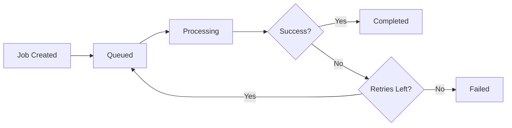

## Overview

CrossConnect-Phos uses BullMQ for background job processing. Jobs handle data synchronization between external platforms and the database, running asynchronously with retry logic and error handling.

## Job queues

Three main queues process different types of data:

<CardGroup cols={3}>
  <Card title="Products queue" icon="box">
    Synchronizes product and inventory data (concurrency: 5)
  </Card>
  <Card title="Orders queue" icon="receipt">
    Synchronizes order and order items data
  </Card>
  <Card title="Returns queue" icon="rotate-left">
    Synchronizes returns (Amazon, Walmart, Shopify, Target only)
  </Card>
</CardGroup>

### Queue configuration

Each queue is configured in `JobsModule` with:

```typescript
BullModule.registerQueue({
  name: 'products',
  defaultJobOptions: {
    attempts: 3,
    backoff: {
      type: 'exponential',
      delay: 2000,  // 2 seconds base delay
    },
    removeOnComplete: true,
    removeOnFail: false,
  },
})
```

**Job naming convention:**
- Products: `products-{storeId}-{timestamp}`
- Orders: `orders-{storeId}-{timestamp}`
- Returns: `returns-{storeId}-{timestamp}`

## How jobs work

### Job lifecycle



1. **Created** — Job is added to the queue
2. **Queued** — Job waits for an available worker
3. **Processing** — Worker executes the job
4. **Completed** — Job finishes successfully
5. **Failed** — Job fails after all retries

### Actual job configuration

Jobs created by TasksService use enhanced retry logic:

```typescript
// From tasks.service.ts
await this.productsQueue.add(
  `${store.platform}.products`,
  {
    storeId: store.id,
    platform: store.platform,
    orgId: store.org_id || 'unknown',
    credentials,
    since,  // Incremental sync timestamp
  },
  {
    jobId: `products-${store.id}-${Date.now()}`,
    removeOnComplete: true,
    attempts: 5,  // 5 retries (not 3)
    backoff: { 
      type: 'exponential', 
      delay: 5000  // 5 second base delay
    },
    removeOnFail: false,  // Keep failed jobs for debugging
  }
);
```

**Cleanup policy:**
- Completed jobs: Removed after 7 days (via daily cleanup task)
- Failed jobs: Kept indefinitely for debugging
- Cleanup runs daily at variable times via `@Interval(86400000)`

## Creating jobs

### From a service

Inject the queue and add jobs:

```typescript
import { InjectQueue } from '@nestjs/bull';
import { Queue } from 'bull';

@Injectable()
export class ShopifyService {
  constructor(
    @InjectQueue('products') private productsQueue: Queue,
  ) {}

  async syncProducts(storeId: string) {
    await this.productsQueue.add('sync', {
      storeId,
      platform: 'shopify',
      timestamp: new Date().toISOString(),
    });
  }
}
```

### Job options

Customize individual jobs:

```typescript
await this.productsQueue.add(
  'sync',
  { storeId: 'store-123' },
  {
    priority: 1,              // Higher priority (lower number = higher priority)
    delay: 60000,             // Delay 60 seconds before processing
    attempts: 5,              // Override default retry attempts
    jobId: 'unique-job-id',   // Prevent duplicate jobs
  }
);
```

## Processing jobs

### Creating a processor

Processors handle job execution:

```typescript
import { Processor, Process } from '@nestjs/bull';
import { Job } from 'bull';

@Processor('products')
export class ProductsProcessor {
  constructor(
    private readonly shopifyService: ShopifyService,
    private readonly productsRepository: ProductsRepository,
  ) {}

  @Process('sync')
  async handleProductSync(job: Job) {
    const { storeId, platform } = job.data;

    // Update job progress
    await job.progress(10);

    // Fetch products from platform
    const products = await this.shopifyService.fetchProducts(storeId);
    await job.progress(50);

    // Save to database
    await this.productsRepository.bulkUpsert(products);
    await job.progress(100);

    return {
      success: true,
      productsCount: products.length,
    };
  }
}
```

### Error handling

Handle errors gracefully:

```typescript
@Process('sync')
async handleProductSync(job: Job) {
  try {
    // Process job
    return { success: true };
  } catch (error) {
    // Log error
    console.error('Job failed:', error);

    // Throw to trigger retry
    throw error;
  }
}
```

### Job events

Listen to job events:

```typescript
@Processor('products')
export class ProductsProcessor {
  @OnQueueActive()
  onActive(job: Job) {
    console.log(`Processing job ${job.id}...`);
  }

  @OnQueueCompleted()
  onCompleted(job: Job, result: any) {
    console.log(`Job ${job.id} completed:`, result);
  }

  @OnQueueFailed()
  onFailed(job: Job, error: Error) {
    console.error(`Job ${job.id} failed:`, error.message);
  }
}
```

## Scheduled jobs

The TasksService schedules recurring jobs using NestJS Schedule.

### Polling stores

The service polls active stores and enqueues sync jobs:

```typescript
@Injectable()
export class TasksService {
  @Cron('*/15 * * * *')  // Every 15 minutes
  async pollStores() {
    const activeStores = await this.storesRepository.findActive();

    for (const store of activeStores) {
      // Enqueue product sync
      await this.productsQueue.add('sync', {
        storeId: store.id,
        platform: store.platform,
      });

      // Enqueue order sync
      await this.ordersQueue.add('sync', {
        storeId: store.id,
        platform: store.platform,
      });
    }
  }
}
```

### Health checks

Regular health checks ensure system stability:

```typescript
@Cron('*/5 * * * *')  // Every 5 minutes
async healthCheck() {
  // Check Redis connection
  const redisHealth = await this.checkRedis();

  // Check Supabase connection
  const dbHealth = await this.checkDatabase();

  // Log results
  console.log('Health check:', { redisHealth, dbHealth });
}
```

### Cleanup old jobs

Remove completed jobs to prevent database bloat:

```typescript
@Cron('0 2 * * *')  // Daily at 2 AM
async cleanupOldJobs() {
  const queues = ['products', 'orders', 'returns'];

  for (const queueName of queues) {
    const queue = this.getQueue(queueName);
    
    // Remove completed jobs older than 7 days
    await queue.clean(7 * 24 * 60 * 60 * 1000, 'completed');
    
    // Remove failed jobs older than 14 days
    await queue.clean(14 * 24 * 60 * 60 * 1000, 'failed');
  }
}
```

## Monitoring jobs

### Queue statistics

Get queue statistics:

```typescript
const queue = this.productsQueue;

const jobCounts = await queue.getJobCounts();
// { waiting: 5, active: 2, completed: 100, failed: 3 }

const waiting = await queue.getWaiting();
const active = await queue.getActive();
const completed = await queue.getCompleted();
const failed = await queue.getFailed();
```

### Job status

Check individual job status:

```typescript
const job = await queue.getJob('job-id');

if (job) {
  const state = await job.getState();  // 'waiting', 'active', 'completed', 'failed'
  const progress = job.progress();     // 0-100
  const result = job.returnvalue;      // Job result
}
```

### BullBoard (optional)

Install Bull Board for a web UI:

```bash
npm install @bull-board/api @bull-board/nestjs
```

Access the dashboard at `/admin/queues`.

## Best practices

<AccordionGroup>
  <Accordion title="Keep jobs idempotent">
    Jobs should produce the same result when run multiple times:
    ```typescript
    // Good: Upsert instead of insert
    await this.repository.upsert(data);

    // Bad: Insert may fail on retry
    await this.repository.insert(data);
    ```
  </Accordion>

  <Accordion title="Use job IDs to prevent duplicates">
    ```typescript
    await queue.add('sync', data, {
      jobId: `sync-${storeId}-${date}`,
    });
    ```
  </Accordion>

  <Accordion title="Update progress for long jobs">
    ```typescript
    await job.progress(25);  // 25% complete
    await job.progress(50);  // 50% complete
    await job.progress(100); // Complete
    ```
  </Accordion>

  <Accordion title="Log important events">
    ```typescript
    console.log(`Starting sync for store ${storeId}`);
    console.log(`Synced ${count} products`);
    ```
  </Accordion>

  <Accordion title="Handle rate limits">
    ```typescript
    if (error.status === 429) {
      // Wait before retry
      await new Promise(resolve => setTimeout(resolve, 60000));
      throw error;  // Trigger retry
    }
    ```
  </Accordion>
</AccordionGroup>

## Troubleshooting

<AccordionGroup>
  <Accordion title="Jobs not processing">
    **Check Redis connection:**
    ```bash
    redis-cli ping
    ```

    **Verify queue configuration:**
    ```typescript
    console.log(await queue.getJobCounts());
    ```

    **Check for stuck jobs:**
    ```typescript
    const active = await queue.getActive();
    console.log('Active jobs:', active.length);
    ```
  </Accordion>

  <Accordion title="Jobs failing repeatedly">
    **Check error logs:**
    ```typescript
    const failed = await queue.getFailed();
    failed.forEach(job => {
      console.log(job.failedReason);
    });
    ```

    **Increase retry attempts:**
    ```typescript
    await queue.add('sync', data, {
      attempts: 5,  // More retries
      backoff: {
        type: 'exponential',
        delay: 10000,  // Longer delay
      },
    });
    ```
  </Accordion>

  <Accordion title="Memory issues">
    **Clean old jobs more frequently:**
    ```typescript
    await queue.clean(1 * 24 * 60 * 60 * 1000, 'completed');
    ```

    **Reduce job retention:**
    ```typescript
    removeOnComplete: {
      age: 1 * 24 * 60 * 60,  // 1 day instead of 7
      count: 100,              // Keep fewer jobs
    }
    ```
  </Accordion>
</AccordionGroup>

## Advanced patterns

### Job chaining

Chain jobs together:

```typescript
const productJob = await productsQueue.add('sync', { storeId });

productJob.finished().then(() => {
  // Start order sync after products complete
  ordersQueue.add('sync', { storeId });
});
```

### Batch processing

Process multiple items in batches:

```typescript
const storeIds = ['store-1', 'store-2', 'store-3'];

const jobs = storeIds.map(storeId =>
  queue.add('sync', { storeId })
);

await Promise.all(jobs.map(job => job.finished()));
```

### Priority queues

Use priorities for important jobs:

```typescript
// High priority (processes first)
await queue.add('sync', { storeId }, { priority: 1 });

// Normal priority
await queue.add('sync', { storeId }, { priority: 5 });

// Low priority (processes last)
await queue.add('sync', { storeId }, { priority: 10 });
```

## Next steps

<CardGroup cols={2}>
  <Card title="Webhooks" icon="webhook" href="/guides/webhooks">
    Learn about real-time event processing.
  </Card>

  <Card title="Backend development" icon="server" href="/guides/backend">
    Understand the backend architecture.
  </Card>

  <Card title="Troubleshooting" icon="wrench" href="/guides/troubleshooting">
    Find solutions to common issues.
  </Card>

  <Card title="Deployment" icon="rocket" href="/guides/deployment">
    Deploy to production.
  </Card>
</CardGroup>
