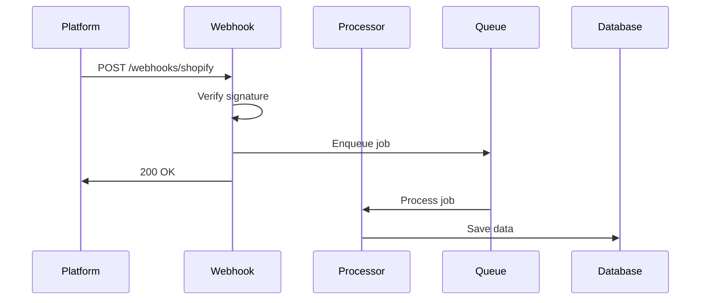

## Overview

CrossConnect-Phos supports webhooks for real-time event processing from Shopify, TikTok, and Walmart. Webhooks allow platforms to notify your application immediately when events occur, eliminating the need for constant polling.

## Supported platforms

<CardGroup cols={3}>
  <Card title="Shopify" icon="shopify" iconType="brands">
    Product updates, order creation, inventory changes
  </Card>
  <Card title="TikTok" icon="tiktok" iconType="brands">
    Order events, product updates
  </Card>
  <Card title="Walmart" icon="store">
    Order updates, inventory changes
  </Card>
</CardGroup>

## How webhooks work



1. Platform sends HTTP POST to webhook endpoint
2. Webhook handler verifies the request signature
3. Event is enqueued as a background job
4. Webhook responds immediately with 200 OK
5. Job processor handles the event asynchronously

## Webhook endpoints

### Shopify webhooks

**Endpoint:** `/api/webhooks/shopify/{storeId}/{userId}`

**Supported events:**
- `products/create` — New product created
- `products/update` — Product updated
- `products/delete` — Product deleted
- `orders/create` — New order placed
- `orders/updated` — Order updated
- `inventory_levels/update` — Inventory changed

**Automatic webhook creation:**

The `ShopifyWebhookService` automatically creates webhooks during store setup:

```typescript
async reconcileWebhooks(
  credentials: any,
  storeId: string,
  userId: string,
  topics: string[],
) {
  this.shopify.initialize(credentials);

  const baseUrl = `${this.config.get('APP_URL')}/api/webhooks/shopify/${storeId}/${userId}`;

  // List existing webhooks
  const existing = await this.shopify.execute<ListWebhooksQuery>(LIST_WEBHOOKS);
  const existingTopics = new Set(
    existing.webhookSubscriptions.nodes.map(w => w.topic)
  );

  // Create missing webhooks
  for (const topic of topics) {
    if (existingTopics.has(topic)) continue;

    await this.shopify.execute<WebhookCreateMutation>(
      CREATE_WEBHOOK,
      { topic, callbackUrl: baseUrl }
    );

    this.logger.log(`Created webhook: ${topic}`);
  }
}
```

**Webhook validation:**

```typescript
@UseGuards(ShopifyWebhookGuard)
@Post(':storeId/:userId')
async handleWebhook(
  @Param('storeId') storeId: string,
  @Param('userId') userId: string,
  @Headers('x-shopify-topic') topic: string,
  @Headers('x-shopify-shop-domain') shop: string,
  @Body() payload: any,
) {
  // ShopifyWebhookGuard validates HMAC signature
  await this.webhookService.processWebhook(topic, payload, shop);
  return { success: true };
}
```

**Example request:**

```http
POST /api/webhooks/shopify/store-123/user-456
X-Shopify-Topic: products/create
X-Shopify-Hmac-Sha256: base64-encoded-signature
X-Shopify-Shop-Domain: example.myshopify.com

{
  "id": 123456789,
  "title": "New Product",
  "variants": [...]
}
```

### TikTok webhooks

**Endpoint:** `/api/webhooks/tiktok`

**Supported events:**
- `ORDER_STATUS_CHANGE` — Order status updated
- `PRODUCT_UPDATE` — Product information changed

**Example request:**

```json
POST /api/webhooks/tiktok
Content-Type: application/json

{
  "type": "ORDER_STATUS_CHANGE",
  "data": {
    "order_id": "123456",
    "status": "SHIPPED"
  },
  "timestamp": 1234567890
}
```

### Walmart webhooks

**Endpoint:** `/api/webhooks/walmart`

**Supported events:**
- Order updates
- Inventory changes

## Setting up webhooks

### 1. Configure webhook URLs

Set your webhook URLs in each platform:

<Tabs>
  <Tab title="Shopify">
    1. Go to Settings → Notifications → Webhooks
    2. Add webhook with URL: `https://your-domain.com/api/webhooks/shopify`
    3. Select events to subscribe to
    4. Shopify will automatically include the HMAC signature
  </Tab>

  <Tab title="TikTok">
    1. Go to TikTok Shop Seller Center → Settings → Open Platform
    2. Configure webhook URL: `https://your-domain.com/api/webhooks/tiktok`
    3. Subscribe to desired events
    4. Save the webhook secret for signature verification
  </Tab>

  <Tab title="Walmart">
    1. Access Walmart Seller Center → API Settings
    2. Configure webhook endpoint: `https://your-domain.com/api/webhooks/walmart`
    3. Enable event notifications
  </Tab>
</Tabs>

### 2. Store webhook secrets

Add webhook secrets to your store credentials in the database:

```typescript
await storeCredentialsRepository.update(storeId, {
  webhook_secret: 'your-webhook-secret',
});
```

### 3. Test webhooks

Most platforms provide webhook testing tools:

- **Shopify:** Use the "Send test notification" button
- **TikTok:** Use the webhook testing interface
- **Walmart:** Contact support for test events

## Implementing webhook handlers

### Controller

Webhook controllers receive and validate requests:

```typescript
@Controller('webhooks/shopify')
export class ShopifyWebhookController {
  constructor(
    private readonly webhookService: ShopifyWebhookService,
  ) {}

  @Post()
  async handleWebhook(
    @Headers('x-shopify-hmac-sha256') signature: string,
    @Headers('x-shopify-topic') topic: string,
    @Headers('x-shopify-shop-domain') shop: string,
    @Body() payload: any,
  ) {
    // Verify signature
    const isValid = await this.webhookService.verifySignature(
      payload,
      signature,
      shop,
    );

    if (!isValid) {
      throw new UnauthorizedException('Invalid webhook signature');
    }

    // Process webhook
    await this.webhookService.processWebhook(topic, payload, shop);

    return { success: true };
  }
}
```

### Service

Services handle webhook processing logic:

```typescript
@Injectable()
export class ShopifyWebhookService {
  constructor(
    @InjectQueue('products') private productsQueue: Queue,
    @InjectQueue('orders') private ordersQueue: Queue,
    private storeCredentialsRepository: StoreCredentialsRepository,
  ) {}

  async verifySignature(
    payload: any,
    signature: string,
    shop: string,
  ): Promise<boolean> {
    const credentials = await this.storeCredentialsRepository.findByShop(shop);
    const secret = credentials.webhook_secret;

    const hash = crypto
      .createHmac('sha256', secret)
      .update(JSON.stringify(payload))
      .digest('base64');

    return hash === signature;
  }

  async processWebhook(topic: string, payload: any, shop: string) {
    const store = await this.storesRepository.findByShop(shop);

    switch (topic) {
      case 'products/create':
      case 'products/update':
        await this.productsQueue.add('webhook-update', {
          storeId: store.id,
          productId: payload.id,
          data: payload,
        });
        break;

      case 'orders/create':
        await this.ordersQueue.add('webhook-create', {
          storeId: store.id,
          orderId: payload.id,
          data: payload,
        });
        break;

      default:
        console.log(`Unhandled webhook topic: ${topic}`);
    }
  }
}
```

## Signature verification

### Shopify (actual implementation)

Shopify uses HMAC-SHA256 with raw body validation via guard:

```typescript
@Injectable()
export class ShopifyWebhookGuard implements CanActivate {
  constructor(
    private readonly storeCredentialsService: StoreCredentialsService,
  ) {}

  async canActivate(context: ExecutionContext): Promise<boolean> {
    const request = context.switchToHttp().getRequest();
    const storeId = request.params.storeId;

    // Get webhook secret from encrypted credentials
    const credentials = await this.storeCredentialsService
      .getCredentialsByStoreId(storeId);

    const secret = credentials.webhook_secret;
    const signature = request.headers['x-shopify-hmac-sha256'];
    const rawBody = request.rawBody;  // Requires rawBody: true

    // Calculate HMAC
    const hash = crypto
      .createHmac('sha256', secret)
      .update(rawBody, 'utf8')
      .digest('base64');

    if (hash !== signature) {
      throw new UnauthorizedException('Invalid webhook signature');
    }

    return true;
  }
}
```

**Usage:**

```typescript
@Controller('webhooks/shopify')
export class ShopifyWebhookController {
  @UseGuards(ShopifyWebhookGuard)  // Validates before processing
  @Post(':storeId/:userId')
  async handleWebhook(@Body() payload: any) {
    // Signature already validated by guard
    await this.processWebhook(payload);
    return { success: true };
  }
}
```

### TikTok

TikTok uses a custom signature algorithm:

```typescript
function verifyTikTokWebhook(payload: any, signature: string, secret: string): boolean {
  const timestamp = payload.timestamp;
  const data = JSON.stringify(payload.data);
  
  const message = `${timestamp}${data}`;
  const hash = crypto
    .createHmac('sha256', secret)
    .update(message)
    .digest('hex');

  return hash === signature;
}
```

### Walmart

Walmart provides signature verification details in their API documentation.

## Webhook security

<AccordionGroup>
  <Accordion title="Always verify signatures">
    Never process webhooks without verifying the signature. This prevents unauthorized requests.

    ```typescript
    if (!isValidSignature) {
      throw new UnauthorizedException('Invalid signature');
    }
    ```
  </Accordion>

  <Accordion title="Use HTTPS">
    Always use HTTPS for webhook endpoints to prevent man-in-the-middle attacks.
  </Accordion>

  <Accordion title="Implement rate limiting">
    Protect against webhook flooding:

    ```typescript
    @UseGuards(ThrottlerGuard)
    @Throttle(100, 60)  // 100 requests per minute
    @Post()
    async handleWebhook() {
      // ...
    }
    ```
  </Accordion>

  <Accordion title="Store secrets securely">
    Never hardcode webhook secrets. Store them encrypted in the database or use a secrets manager.
  </Accordion>

  <Accordion title="Validate payload structure">
    Validate webhook payloads before processing:

    ```typescript
    const schema = z.object({
      id: z.number(),
      title: z.string(),
      // ...
    });

    const validated = schema.parse(payload);
    ```
  </Accordion>
</AccordionGroup>

## Handling webhook failures

### Retry logic

Platforms typically retry failed webhooks:

- **Shopify:** Retries up to 19 times over 48 hours
- **TikTok:** Retries with exponential backoff
- **Walmart:** Retries based on configuration

### Idempotency

Make webhook handlers idempotent:

```typescript
async processProductWebhook(payload: any) {
  // Use upsert instead of insert
  await this.productsRepository.upsert({
    id: payload.id,
    ...payload,
  });
}
```

### Error handling

Log errors but still return 200 OK:

```typescript
@Post()
async handleWebhook(@Body() payload: any) {
  try {
    await this.processWebhook(payload);
  } catch (error) {
    // Log error
    console.error('Webhook processing failed:', error);
    
    // Still return 200 to prevent retries
    // (job will be retried by BullMQ)
  }

  return { success: true };
}
```

## Testing webhooks locally

### Using ngrok

Expose your local server to the internet:

```bash
# Install ngrok
npm install -g ngrok

# Start your backend
npm run start:dev

# Expose port 3001
ngrok http 3001
```

Use the ngrok URL (e.g., `https://abc123.ngrok.io/api/webhooks/shopify`) as your webhook endpoint.

### Manual testing

Send test webhooks with curl:

```bash
curl -X POST http://localhost:3001/api/webhooks/shopify \
  -H "Content-Type: application/json" \
  -H "X-Shopify-Topic: products/create" \
  -H "X-Shopify-Hmac-Sha256: test-signature" \
  -H "X-Shopify-Shop-Domain: test.myshopify.com" \
  -d '{"id": 123, "title": "Test Product"}'
```

## Monitoring webhooks

### Logging

Log all webhook events:

```typescript
@Post()
async handleWebhook(@Body() payload: any, @Headers() headers: any) {
  console.log('Webhook received:', {
    topic: headers['x-shopify-topic'],
    shop: headers['x-shopify-shop-domain'],
    timestamp: new Date().toISOString(),
  });

  // Process webhook
}
```

### Metrics

Track webhook metrics:

```typescript
private webhookCounter = 0;
private failedWebhooks = 0;

@Post()
async handleWebhook() {
  this.webhookCounter++;
  
  try {
    await this.processWebhook();
  } catch (error) {
    this.failedWebhooks++;
    throw error;
  }
}
```

### Alerting

Set up alerts for webhook failures:

```typescript
if (this.failedWebhooks > 10) {
  await this.alertsRepository.create({
    type: 'webhook_failures',
    message: `${this.failedWebhooks} webhooks failed`,
    severity: 'high',
  });
}
```

## Best practices

<AccordionGroup>
  <Accordion title="Respond quickly">
    Always respond within 5 seconds to prevent timeouts. Process data asynchronously.
  </Accordion>

  <Accordion title="Use job queues">
    Enqueue webhook data for background processing instead of processing synchronously.
  </Accordion>

  <Accordion title="Handle duplicates">
    Platforms may send duplicate webhooks. Use idempotent operations.
  </Accordion>

  <Accordion title="Log everything">
    Log all webhook events for debugging and auditing.
  </Accordion>

  <Accordion title="Monitor webhook health">
    Track success rates and alert on failures.
  </Accordion>
</AccordionGroup>

## Next steps

<CardGroup cols={2}>
  <Card title="Background jobs" icon="gears" href="/guides/jobs">
    Learn about job processing.
  </Card>

  <Card title="Connectors" icon="plug" href="/connectors/overview">
    Explore platform integrations.
  </Card>

  <Card title="Backend development" icon="server" href="/guides/backend">
    Understand the backend architecture.
  </Card>

  <Card title="Troubleshooting" icon="wrench" href="/guides/troubleshooting">
    Find solutions to common issues.
  </Card>
</CardGroup>
